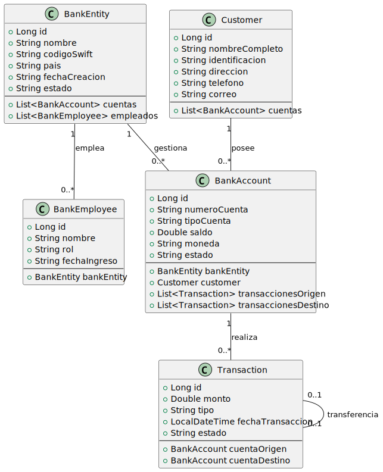
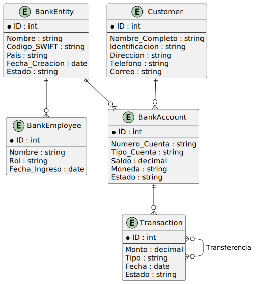
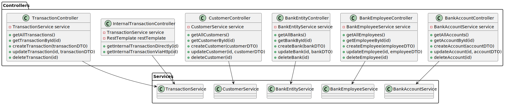

# 📊 Diagramas del Proyecto

Este archivo contiene los diagramas que representan la estructura y las relaciones entre los componentes del sistema, facilitando la comprensión de la arquitectura del proyecto.

## 📦 Diagrama de Clases (Class Diagram)

Este es el diagrama de clases que representa la estructura de las clases y sus relaciones dentro del sistema:

## 🔗 Diagrama Entidad-Relación (ER Diagram)

Este diagrama ER ilustra las entidades del sistema y las relaciones entre ellas:

## 🗂️ Diagrama Modelo-Controlador (Model-Controller Diagram)

Este diagrama muestra la interacción entre los componentes del **Modelo** y el **Controlador**, destacando cómo fluyen los datos y la lógica del negocio en la arquitectura del sistema:

